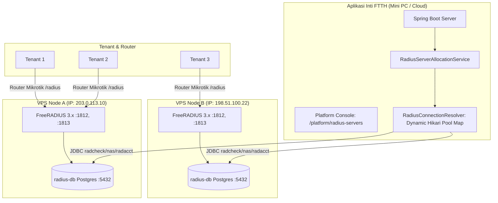
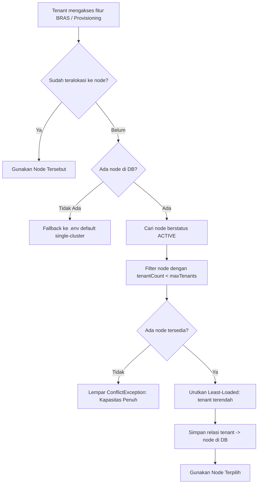

# Multi-Server RADIUS & Auto-Distribution Tenant

Dokumen ini menjelaskan arsitektur, cara kerja, dan panduan operasional untuk fitur **Multi-Server RADIUS Cluster dengan Auto-Distribution Tenant** pada FTTH SaaS.

---

## 1. Latar Belakang & Motivasi

Secara default, aplikasi FTTH berjalan dengan model single-cluster RADIUS bawaan (`docs/radius-as-a-service.md`). Namun dalam skenario operasional nyata:
1. **Kebutuhan IP Publik Statis**: Banyak Mini PC / server on-premise berada di belakang NAT / CGNAT tanpa IP publik statis. Router Mikrotik memerlukan IP publik statis untuk mengirim paket autentikasi (UDP 1812) dan akunting (UDP 1813).
2. **Isolasi Beban & Multi-Node**: Ketika jumlah tenant bertambah, beban radius-db dan FreeRADIUS dapat disebar ke beberapa VPS murah (misal 1 vCPU, 1 GB RAM seharga Rp 45.000 – Rp 75.000/bulan).
3. **Batas Kapasitas Tenant (*Quota Limit*)**: Platform admin dapat menentukan berapa tenant maksimal yang boleh ditampung oleh setiap node (*misal 2 tenant per node VPS*). Sistem secara otomatis mengalokasikan tenant baru ke node yang masih memiliki kuota kosong (*auto-distribute*).

---

## 2. Arsitektur Multi-Server RADIUS



### Karakteristik Desain:
* **Stateless Sharding**: Setiap node RADIUS berdiri sendiri dengan pasangan daemon FreeRADIUS dan PostgreSQL (`radius-db`).
* **Dynamic Connection Pooling**: Server FTTH mempertahankan connection pool JDBC terpisah untuk setiap node terdaftar. Koneksi dibuat secara *on-demand* saat tenant membutuhkan provisioning atau pembacaan akunting.
* **Transparan bagi Tenant**: Tenant tidak perlu memilih server secara manual. Saat membuka menu **BRAS & RADIUS**, kartu panduan RouterOS otomatis menyajikan IP publik dan shared secret milik node yang dialokasikan untuk tenant tersebut.

---

## 3. Algoritma Auto-Distribution

Alokasi ditangani oleh `RadiusServerAllocationService`:



### Status Siklus Hidup Node (`RadiusServerStatus`)
* **`ACTIVE`**: Node aktif beroperasi dan menerima tenant baru hingga batas `maxTenants`.
* **`DRAINING`**: Node tetap melayani tenant yang sudah ada, namun **tidak menerima tenant baru**. Berguna saat server hendak dipersiapkan untuk maintenance atau migrasi.
* **`DISABLED`**: Node dinonaktifkan sementara.

---

## 4. Panduan Menyiapkan Node RADIUS di VPS Baru

Jika Anda membeli VPS Ubuntu 24.04/26.04 (1 vCPU, 1 GB RAM):

### Langkah 1: Pasang Docker di VPS
```bash
curl -fsSL https://get.docker.com | sh
sudo systemctl enable --now docker
```

### Langkah 2: Siapkan Stack di `/opt/radius-node/docker-compose.yml`
```yaml
services:
  radius-db:
    image: postgres:16-alpine
    restart: unless-stopped
    environment:
      POSTGRES_DB: radius
      POSTGRES_USER: radius
      POSTGRES_PASSWORD: "GantiDenganPasswordKuatDb123"
    volumes:
      - radiusdata:/var/lib/postgresql/data
      - ./initdb:/docker-entrypoint-initdb.d:ro
    ports:
      # Buka untuk koneksi JDBC dari server aplikasi FTTH
      - "5432:5432"

  freeradius:
    image: freeradius/freeradius-server:3.2.5
    restart: unless-stopped
    depends_on:
      - radius-db
    environment:
      RADIUS_DB_HOST: radius-db
      RADIUS_DB_PORT: "5432"
      RADIUS_DB_NAME: radius
      RADIUS_DB_USER: radius
      RADIUS_DB_PASSWORD: "GantiDenganPasswordKuatDb123"
    volumes:
      - ./mods-enabled/sql:/etc/freeradius/mods-enabled/sql:ro
      - ./clients.conf:/etc/freeradius/clients.conf:ro
    ports:
      - "1812:1812/udp"
      - "1813:1813/udp"

volumes:
  radiusdata:
```

> [!TIP]
> Skrip init SQL untuk skema FreeRADIUS (`schema.sql` dan `nas.sql`) dapat disalin dari folder `deploy/radius/freeradius/` di repository aplikasi.

### Langkah 3: Konfigurasi Firewall (UFW)
```bash
sudo ufw default deny incoming
sudo ufw default allow outgoing
sudo ufw allow 22/tcp       # SSH
sudo ufw allow 1812/udp     # RADIUS Auth (Mikrotik)
sudo ufw allow 1813/udp     # RADIUS Acct (Mikrotik)

# PENTING: Batasi port 5432 Postgres HANYA untuk IP server FTTH (atau lewat VPN)
sudo ufw allow from <IP-SERVER-FTTH> to any port 5432 proto tcp

sudo ufw enable
```

---

## 5. Panduan Penggunaan Platform Admin (Web Console)

Platform Admin mengelola node RADIUS melalui menu **Infrastruktur ➔ Server RADIUS** (`/platform/radius-servers`).

### A. Mendaftarkan Node Baru
1. Masuk sebagai Platform Admin.
2. Buka menu **Server RADIUS**, klik **+ Tambah Node RADIUS**.
3. Isi data node:
   * **Nama Node**: Identifier unik (*mis. `VPS-SG-Node-1`*).
   * **IP Publik / Host**: Alamat publik VPS (*mis. `203.0.113.10`*).
   * **Batas Maksimum Tenant**: Kapasitas tenant (*mis. `2`*).
   * **Port Auth / Acct / CoA**: Bawaan `1812`, `1813`, `3799`.
   * **Default Shared Secret**: Secret autentikasi Mikrotik.
   * **Koneksi Database**: JDBC URL (*mis. `jdbc:postgresql://203.0.113.10:5432/radius`*), User, dan Password.
4. Klik tombol **Uji Koneksi Database** untuk memastikan server FTTH berhasil menghubungi `radius-db` di VPS.
5. Klik **Simpan Node**.

### B. Pemantauan Kapasitas
Pada tabel daftar node:
* Badge **Kapasitas Tenant** menampilkan kuota terpakai (*mis. `1 / 2 Tenant (Tersedia)`* atau *`2 / 2 Tenant (Penuh)`*).
* Jika semua node berstatus penuh, tenant baru yang mengakses menu BRAS akan memperoleh pemberitahuan bahwa kapasitas cluster telah tercapai dan perlu penambahan node oleh admin.

### C. Proteksi Penghapusan
Node yang masih memiliki tenant aktif tidak dapat dihapus langsung (*fail-safe*). Admin harus memindahkan tenant ke node lain atau mencabut tenant terlebih dahulu sebelum node dapat dihapus.

---

## 6. Referensi REST API Platform Admin

Semua endpoint berada di bawah `/api/platform/radius-servers` dan membutuhkan izin `radius.server.view` atau `radius.server.manage`.

| Method | Endpoint | Izin | Keterangan |
|---|---|---|---|
| `GET` | `/api/platform/radius-servers` | `radius.server.view` | Daftar semua node RADIUS beserta jumlah tenant terpasang. |
| `GET` | `/api/platform/radius-servers/{id}` | `radius.server.view` | Detail node dan ID tenant yang terhubung. |
| `POST` | `/api/platform/radius-servers` | `radius.server.manage` | Pendaftaran node RADIUS baru. |
| `PUT` | `/api/platform/radius-servers/{id}` | `radius.server.manage` | Perbarui spesifikasi, kredensial, atau kapasitas node. |
| `DELETE` | `/api/platform/radius-servers/{id}` | `radius.server.manage` | Hapus node (gagal jika tenant > 0). |
| `POST` | `/api/platform/radius-servers/test-connection` | `radius.server.manage` | Uji coba koneksi JDBC mentah (sebelum disimpan). |
| `POST` | `/api/platform/radius-servers/{id}/test-connection` | `radius.server.manage` | Uji coba koneksi JDBC ke node yang sudah tersimpan. |
